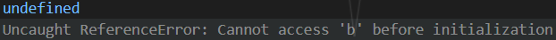

# 一、let

## 1.基本用法

let 用来声明变量，所声明的变量只在 let 命令所在的代码块内有效。

<lfsz-title>代码</lfsz-title>

```js
var a = [];
for (var i = 0; i < 2; i++) {
  var b = 1;
  let c = 1;
  a[i] = function () {
    var c = 3;
    console.log(i);
  };
}
a[0]();
console.log(b);
console.log(c);
```

<lfsz-title>结果</lfsz-title>


var 定义了 i，i 在当前代码中算是全局变量，每一次循环 i 的值都会变化，也就会导致最后结果输出为 2。  
for 循环中定义循环变量的是一个父作用域，循环体内部是一个子作用域。

## 2.不存在变量提升

<lfsz-title>什么是变量提升？</lfsz-title>  
变量可以在被声明前使用，这就是变量提升。  
但是提升的仅仅是声明而已，复制以及其他的操作都还停留在原来的位置。
<lfsz-title>代码</lfsz-title>

```js
console.log(a);
var a = 1;
console.log(b);
let b = 2;
```

<lfsz-title>结果</lfsz-title>


var 声明的变量 a 发生了变量提升（提升到了函数的最外层），导致在声明 a 之前调用 a 不会报错但是会返回 undefined。

## 3.暂时性死区

<lfsz-title>什么是暂时性死区？</lfsz-title>
在代码块内，使用 let 声明变量之前，该变量不可用，这就可以被称为“暂时性死区”（temporal dead zone，简称 TDZ）。
<lfsz-title>代码</lfsz-title>

```js
var c;
for (var i = 0; i < 2; i++) {
  console.log(c);
  let c = 1;
}
```

<lfsz-title>结果</lfsz-title>


即使在循环体外有声明变量 c，但是循环体内有用 let 声明变量 c，使得循环体内的作用域与变量 c 绑定，也就在变量 c 声明前形成了暂时性死区。  
:::warning
由于"暂时性死区"的存在，使得typeof变得不安全了。不声明变量使用typeof不会报错，但是在"暂时性死区"中，typeof会报错
:::
## 4.不允许重复声明
:::warning
let不允许在相同作用域内重复声明同一个变量
:::
## 5.块级作用域
在es5中只有全局作用域和函数作用域，没有块级作用域的概念。  
<lfsz-title>什么是块级作用域？</lfsz-title>

块级作用域是和let命令绑定的，也就是let声明的变量的有效区间。
<lfsz-title>代码</lfsz-title>

```js
var tmp=1
function a(){
	console.log(tmp);
	if(true){
		var tmp=2
		console.log(tmp);
	}
}
a()
```
<lfsz-title>结果</lfsz-title>


var声明的变量存在变量提升，导致无法得到想要的结果，这里可以通过使用let声明变量，let声明的变量在当前块级作用域下生效，也就是第一个包裹let变量的大括号中生效。
## 6.块级作用域与函数声明
ES5中规定，函数只能在顶层作用域和函数作用域中声明。  
但是浏览器没有遵循这个规则，在浏览器中，在块级作用域声明函数也能正常运行。
ES6中，可以在块级作用域中声明函数，这类似于var操作，存在变量提升。
:::warning
ES6中使用块级作用域必须要有大括号，没有大括号就没有块级作用域
:::
# 二、const
const声明的变量的值不得改动，这里的不得改动不是真的不得改动，而是变量指向的内存地址所保存的数据不得改动。对于简单的数据类型例如（数字、字符串、布尔值），值就保存在变量所指向的内存地址，因此就类似于常量。对于复杂的数据类型例如（对象、数组），变量所指向的内存地址，只是一个指向真正数据的指针，const声明的复杂数据类型，只是保证指针不变，还是可以向数组、对象添加数据。  
const跟let一样，不可重复声明，不存在变量提升，存在暂时性死区
# 三、顶层对象
在浏览器中，顶层对象就是window对象  
在Node中，顶层对象就是global对象  
在ES5中，顶处对象与全局变量等价  
在ES6中，var和function声明的变量是全局变量也是顶层对象，let、const、class声明的变量是全局变量但不是顶层对象